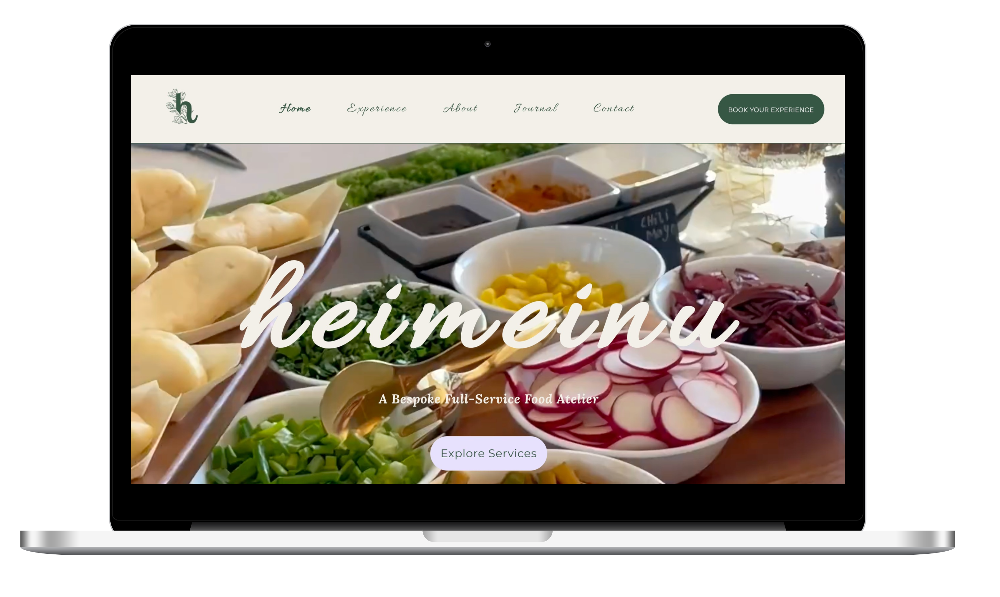

IMPORTANT NOTICE: This repository contains only mockups, documentation, and demonstration assets. This repository is intended for showcase and demonstration purposes only.

# Generative AI Solutions for Small Businesses

This repository showcases the project "Generative AI Solutions for Small Businesses" where generative AI solutions (using GPT, Claude, & Gemini LLMs) were used to develop informational and e-commerce website for for three unique small businesses. The project focuses on creating website wireframes and prototypes along with AI-driven analytics tools to enhance marketing and customer service capabilities.

## Project Highlights
- **AI-Driven Design**: Utilized GPT, Claude, and Gemini LLMs to develop website wireframes and prototypes
- **Analytics Integration**: Implemented AI-powered analytics tools providing actionable business insights
- **Collaborative Approach**: Worked directly with business owners to ensure solutions aligned with their goals
- **Production Implementation**: Translated AI-generated designs into fully functional websites

## Website Mockups Showcase

### Art-Fro Kreationz

**Description:**  
An artistic online platform blending African-inspired art with contemporary lifestyle products. ArtFrokReationz showcases Afrocentric themes. Offerings include original artwork, metal and framed prints, all-over print bags. The site also provides customized art commissions, "Custom Art Wear," and community-driven initiatives like #KreativeKorner and interactive "Sip of Art Class" workshops. [Art-FroKreationz.com](https://www.artfrokreationz.com/)

### Heimeinu

**Description:**  
A bespoke full-service catering founded by Chef Jacky Nicole, Heimeinu creatively blends Cameroonian heritage, Texan roots, and East Asian influences. This culinary experience includes customized catering using fresh, seasonal ingredients from local farms, intimate private dining experiences with culturally diverse menus, and interactive workshops emphasizing culinary education, organic gardening, and cultural immersion. The website also features a journal with recipes, gardening advice, and reflections on holistic well-being and cultural connections, delivering a digital experience that is both rich in culinary storytelling and user-centric design. [Heimeinu.com](https://www.heimeinu.com/)

### Roselynn Manor

**Description:**  
Roselynn Manor, a historic venue, elegantly combines nature, history, and contemporary amenities, providing a unique digital showcase for its diverse offerings. It features stunning event spaces suitable for corporate events, weddings, and special occasions, an elegant tea room offering refined tea experiences, and charming bed and breakfast accommodations blending timeless elegance with modern comfort. The manor emphasizes its heritage charm while ensuring a memorable and engaging experience for visitors, making it an ideal destination for both leisure and cultural gatherings. [RoselynnManor.com](https://www.roselynnmanor.com/)

## Additional Information
- [Features](Docs/features.md)
- [FAQ](docs/faq.md)

## 📄 License
© [2025] Eric A. All Rights Reserved.
